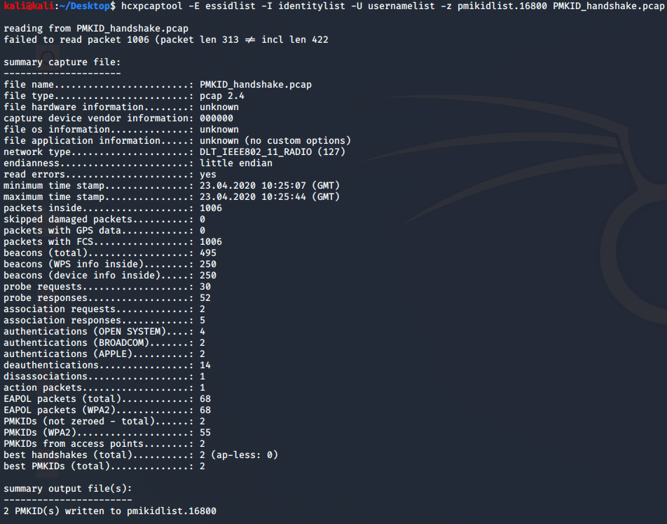
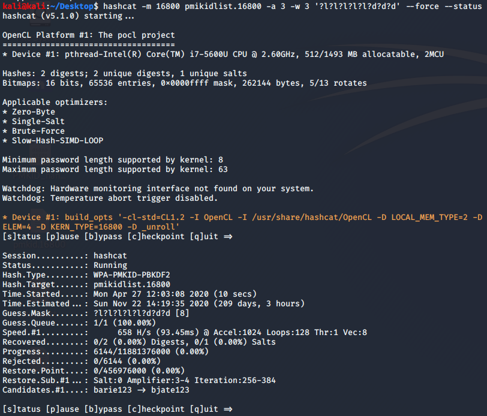
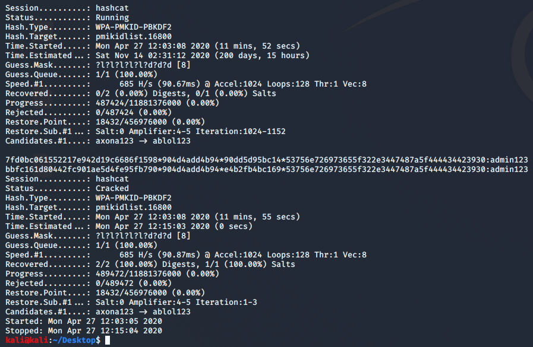

- [Livrables](#livrables)

- [Échéance](#échéance)

- [Travail à réaliser](#travail-à-réaliser)

# Sécurité des réseaux sans fil

## Laboratoire WPA - PMKID

__A faire en équipes de deux personnes__

__Développement à faire en Python 3__

### Pour cette partie pratique, vous devez être capable de :

* A partir d’une capture Wireshark, extraire la valeur de la PMKID utilisant Scapy
* Ecrire un script Python pour Cracker la passphrase WPA utilisant la PMKID

Pour l'explication de l'attaque, référez vous à la video suivante :

[](http://www.youtube.com/watch?v=APkk9C2sydM "PMKID attack")


## Travail à réaliser

### 1. Obtention de la PMKID et des paramètres pour la dérivation de la PMK  

Dans cette première partie, vous allez réutiliser le script de dérivation de clés que vous avez rendu pour le [labo WPA](https://github.com/arubinst/HEIGVD-SWI-Labo4-WPA). Il vous faudra également le fichier de capture [PMKID_handshake.pcap](files/PMKID_handshake.pcap) contenant une tentative d’authentification WPA pas réussie réalisée par un attaquant.

La PMKID est contenue dans le premier message du 4-way handshake de certains AP. Les AP de l'opérateur Sunrise sont vulnérables. Il s'agit donc d'un AP de Sunrise qui a été utilisé pour faire [la capture](files/PMKID_handshake.pcap). 

Voici ce que vous devez faire pour cette première partie :

- __Modifier votre script WPA__ pour qu’il récupère automatiquement, à partir de la capture, la valeur de la PMKID
- Vous aurez aussi besoin de récupérer les valeurs du ```ssid```, ```APmac``` et ```Clientmac``` (ceci est normalement déjà fait par votre script) 


### 2. Cracker la Passphrase utilisant l'attaque PMKID

L'attaque PMKID est une attaque par dictionnaire qui calcule systématiquement une PMK à partir de la passphrase. Cette PMK est utilisée comme clé pour SHA-1 calculé sur une concatenation du string "PMK Name" et les adresses MAC de l'AP et la STA. Les premiers 128 bits (6 octets) du résultat de ce calcul doivent correspondre à la valeur de la PMKID obtenue à partir du premier message du 4-way handshake.

Utilisant votre script précédent, le modifier pour réaliser les taches suivantes :

- Lire une passphrase à partir d’un fichier (wordlist) &rarr; __La passphrase utilisée dans la capture es ```admin123```__
- Dériver la PMK à partir de la passphrase que vous venez de lire et des autres éléments nécessaires contenus dans la capture (cf [exercice 1](#1-obtention-de-la-pmkid-et-des-paramètres-pour-la-dérivation-de-la-pmk))
- Calculer la PMKID (cf vidéo YouTube)
- Comparer la PMKID calculée avec celle récupérée de la capture :
   - Identiques &rarr; La passphrase utilisée est correcte
   - Différents &rarr; Essayer avec une nouvelle passphrase

**Remarque:** On peut voir dans le screenshot çi-dessous que au premier test nous n'avons pas la bonne passphrase dans la liste et que dans la 2ème tentative elle y est.


### 3. Attaque hashcat

A manière de comparaison, réaliser l'attaque sur le [fichier de capture](files/PMKID_handshake.pcap) utilisant la méthode décrite [ici](https://hashcat.net/forum/thread-7717.html).

**Remarque:** L'attaque a été faite sur une VM Kali.

On commence par convertir le fichier pcap vers un format compatible avec hashcat :



On lance ensuite hashcat sur le fichier `pmikidlist.16800`:



Après 12 minutes hashcat trouve le PMKID (`admin123`) de la capture wireshark :




## Livrables

Un fork du repo original . Puis, un Pull Request contenant **vos noms** et :

- Script ```pmkid_attack.py``` **abondamment commenté/documenté** + fichier wordlist
   - Capture d’écran de votre script en action
- Captures d'écran de votre exercice 3
-	Envoyer le hash du commit et votre username GitHub et **les noms des participants** par email au professeur et à l'assistant


## Échéance

Le 04 mai 2020 à 23h59
